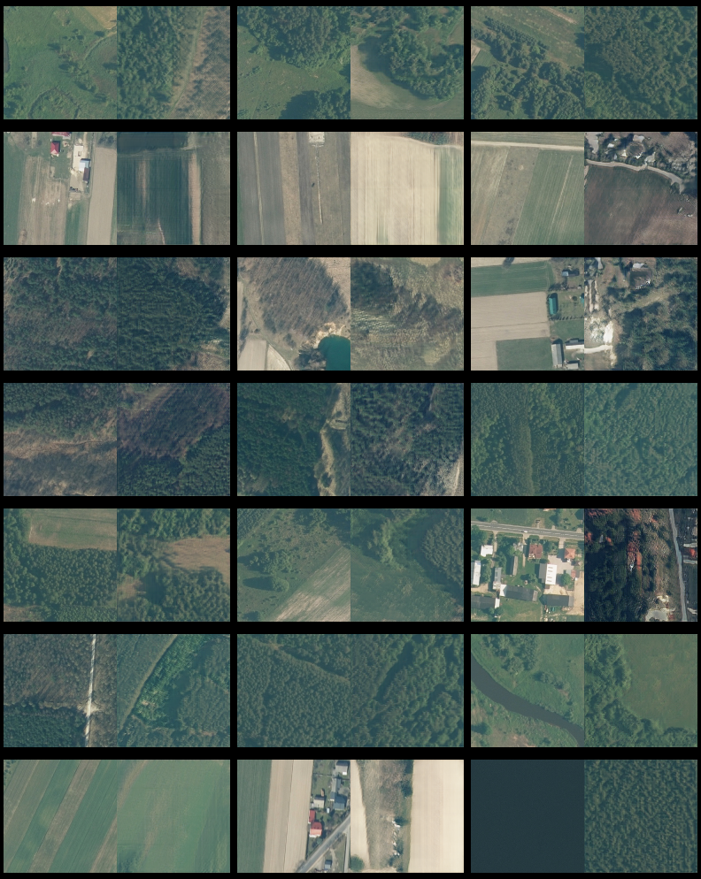

# Aerial imagery feature engineering using bidirectional generative adversarial networks 
## A case study of the Pilica river region, Poland

Maciej Adamiak (SoftwareMill, 02-791 Warsaw, Poland, [OCRID](https://orcid.org/0000-0002-8229-9661), [LinkedIn](https://www.linkedin.com/in/maciejadamiak/))

Krzysztof Będkowski University of Lodz, Faculty of Geographical Sciences, Institute of Urban Geography, Tourism and Geoinformation, 90-139 Łódź, Poland, [ORCID](0000-0001-7945-343X))

Anna Majchrowska (University of Lodz, Faculty of Geographical Sciences, Department of Physical Geography, 90-139 Łódź, Poland, [OCRID](https://orcid.org/0000-0002-1611-6118)) 



## Abstract
Generative adversarial networks (GANs) are a type of neural networks which are characterized by their unique construction and training process. Utilizing the concept of the latent space and exploiting the results of a duel between different GAN components opens up interesting opportunities for computer vision activities such as image inpainting, style transfer or even generative art. GANs have great potential to support aerial and satellite image interpretation activities. Carefully crafting a GAN and applying it on a high-quality dataset can result in nontrivial feature enrichment and dataset augmentation. In this study, we have designed a procedure capable of simultaneously extending orthophoto datasets by generating new artificial samples, and engineering new features by shifting real images into the GAN’s underlying latent space. To accomplish this goal, a modified version of big bidirectional generative adversarial network (BigBiGAN) has been trained on a fine-tailored aerial imagery dataset covering the area of the Pilica river region in Poland. Trained models, precisely the generator and encoder, have been utilized during, respectively, the processes of model quality assurance and feature engineering. Quality assurance was performed by measuring models reconstruction capabilities and by manually verifying, produced by the generator, artificial images. The feature engineering use case, on the other hand, has been presented in a real research scenario which involved latent space clustering and orthophoto unsupervised segmentation.

##

```python
from tensorflow.keras.models import load_model, Model
import tensorflow as tf

from train.blocks import pool_and_double_channels

self.model: Model = load_model('bignigan_encoder.h5', compile=False, custom_objects={
                        'tf': tf,
                        'pool_and_double_channels': pool_and_double_channels
                    })
```
